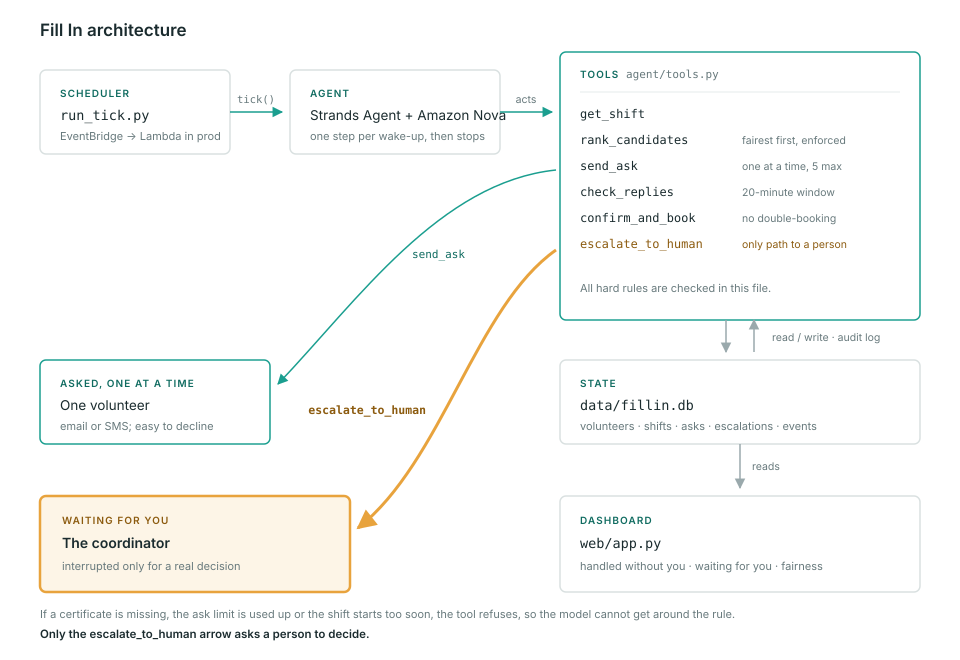

# Fill In

**Nobody phones down the list any more.**

Fill In backfills cancelled volunteer shifts for a community kitchen. When
someone drops out, it works down the roster one person at a time — asks, waits,
moves on, stops the moment the shift is covered — and wakes the coordinator only
when a decision genuinely needs a human.

Built with [Strands Agents](https://strandsagents.com) for the AWS *Agents for
Humans* hackathon, Good Neighbor track.

---

## The problem

A community kitchen runs on a roster of volunteers. Someone cancels four hours
before their shift, and a coordinator starts phoning down a list: *is anyone
free tonight?* First name, no answer. Second name, can't. Third name, yes.

The work isn't hard. It's relentless, it happens at the worst possible times,
and it always lands on the same person. Worse, whoever is phoning reaches for
the reliable names first, so the most dependable volunteers get asked the most
and burn out fastest.

## Who it is for

The volunteer coordinator at a small community kitchen, food bank, or shelter.
Usually one person. Often a volunteer themselves. No budget for scheduling
software and no appetite for another dashboard to check.

So Fill In is built to be *not checked*. The default state is an empty right-hand
column.

## What it does

| | |
|---|---|
| A shift opens up | The agent notices on its next wake-up, without being asked |
| It picks who to contact | Fairest candidate first — see [Fairness](#fairness-is-a-feature) |
| It asks **one** person | And waits out their full response window |
| They decline, or go quiet | It moves to the next name |
| Someone accepts | It books them and releases everyone else |
| It runs out of options | It escalates, once, with everything the coordinator needs |

## How it works



A scheduler wakes the agent. The agent takes exactly **one step** per wake-up and
then stops — it has no loop of its own, no memory between wake-ups, and no way to
act except through six tools. Everything it knows lives in SQLite; everything it
does is written to an audit log that the dashboard renders.

### The rules live in the tools, not the prompt

This is the design decision the whole project rests on. A missing certificate, an
exhausted ask limit, a shift starting too soon — each of these is a `return`
statement in [`agent/tools.py`](agent/tools.py):

```python
if required and required not in vol["certs"].split(","):
    return {"refused": f"{vol['name']} does not hold '{required}'."}
```

A system prompt is a request. A return statement is not. The model can be
confused, jailbroken, or simply wrong, and it still cannot book an uncertified
volunteer onto a shift that needs the certificate, ask two people at once, skip
the fairest volunteer for one it prefers, re-ask someone who already said no, or
reach a human through any path except `escalate_to_human`.

### The escalation policy

| Situation | What the agent does | Who is involved |
|---|---|---|
| A qualified volunteer is free and hasn't been asked yet | Asks exactly one of them, then waits | Nobody |
| Someone is still inside their response window | Refuses to ask anybody else | Nobody |
| The model reaches for anyone but the fairest remaining candidate | Refuses, and names who ranks first | Nobody |
| That person declines, or their window expires | Moves to the next name | Nobody |
| Someone accepts | Books them, releases the others | Nobody |
| Two people accept at once | First accepted ask wins; the other is marked superseded | Nobody |
| 5 people have been asked and nobody accepted | `escalate_to_human` | **You** |
| The shift starts within 2 hours | Escalates immediately — never runs the ask loop | **You** |
| Nobody qualified is available at all | Escalates | **You** |
| Anything is ambiguous | Does nothing, and escalates | **You** |

`escalate_to_human` is the only channel to a person. There is no fallback where
the agent mentions a problem in its reply and hopes somebody reads it.

Every escalation also names who could still cover the shift: the three fairest
volunteers who hold the certificate and are free at that hour. The tool looks
that up and attaches it itself, so it is there however well the model wrote the
rest.

Policy constants, all in [`agent/tools.py`](agent/tools.py):

| Constant | Value | Meaning |
|---|---|---|
| `ASK_TIMEOUT_MINUTES` | 20 | How long one person gets to answer |
| `MAX_ASKS_PER_SHIFT` | 5 | After this, a human decides |
| `URGENT_WINDOW_HOURS` | 2 | Inside this, never run the loop |
| `FATIGUE_ASKS_30D` | 6 | Asked this often lately → back of the queue |

### Fairness is a feature

`rank_candidates` filters out anyone without the required certificate or without
declared availability at that hour, then scores the rest on how much they have
already been carrying:

```
score = 100 − (shifts_last_30d × 8) − (asks_last_30d × 4) + (response_rate × 20)
        − 30 if asked 6+ times in the last 30 days
```

The agent is told to trust that order, but it isn't trusted to. `send_ask`
recomputes the same ranking and refuses anyone except the volunteer at the top
of it, so the model cannot reach past the order for someone it "knows" will say
yes, however it reasons. Already-asked volunteers drop out of the ranking, and a
second ask to the same person is refused. Burning out the reliable volunteers is
a failure, not a win.

---

## Setup

```bash
pip install -r requirements.txt
python data/seed.py
```

Then give the agent a model. Any of these works — the hackathon requires
Strands, not a particular model provider.

**Google Gemini — free tier, no card**

```bash
pip install "strands-agents[gemini]"
setx GEMINI_API_KEY "your-key"
setx FILLIN_PROVIDER gemini
```

Create the key at [Google AI Studio](https://aistudio.google.com/apikey). On
Windows there's no need to open a new terminal after `setx`: Fill In also reads
the user environment directly. Leave billing switched off on that project to stay
on the free tier. Free-tier requests may be used by Google to improve its
products; everything in this repo is synthetic, so nothing real is sent.

**Amazon Bedrock**

```bash
set AWS_ACCESS_KEY_ID=...
set AWS_SECRET_ACCESS_KEY=...
set AWS_DEFAULT_REGION=us-east-1
```

The IAM user needs `AmazonBedrockFullAccess`, and model access has to be enabled
for that model in the Bedrock console in that region.

**Anthropic API**

```bash
pip install "strands-agents[anthropic]"
set ANTHROPIC_API_KEY=...
set FILLIN_PROVIDER=anthropic
```

Check what the agent will use before running it:

```bash
python -m agent.cli doctor
```

| Variable | Default | Notes |
|---|---|---|
| `FILLIN_PROVIDER` | whichever credentials exist | `gemini`, `bedrock` or `anthropic` |
| `FILLIN_MODEL` | `gemini-3.5-flash-lite` (Gemini)<br>`us.anthropic.claude-sonnet-4-5-20250929-v1:0` (Bedrock)<br>`claude-sonnet-5` (Anthropic) | e.g. `gemini-3.8-flash` for a stronger Gemini, or `claude-haiku-4-5` to iterate cheaply on Anthropic |
| `PORT` | `5000` | Dashboard port |

### Run it

Two terminals. The agent in one:

```bash
python run_tick.py 30        # wake every 30 seconds
```

The dashboard in the other:

```bash
python web/app.py           # http://127.0.0.1:5000
```

The dashboard is two columns, and the contrast between them is the whole pitch.

**Handled without you** — left, teal — shows every shift the agent is working as
a card with its *ask chain* inside it: who it asked, in what order, what came
back, who is still deciding and how long they have left, and how many asks remain
before the limit forces a human in. Underneath sits the full audit log.

**Waiting for you** — right, amber — holds unresolved escalations, each carrying
enough context to act on without opening anything else: what the shift is, what
certificate it needs, who has already been contacted, and what the agent
suggests. That amber appears nowhere else in the interface. When nothing needs
you, the column says so in teal, because that is the product working rather than
an empty screen.

The right-hand rail also carries **Fairness** — 30-day load for the three
heaviest carriers against the three the agent reaches for instead, drawn on one
shared scale — plus **the roster this week** as one dot per shift, and the
**policy** the tools enforce.

On a phone the page drops to one column and **Waiting for you** moves to the top.
A coordinator checking in between shifts sees the one thing that needs them
before anything else, not underneath the audit log.

Colour is assigned by job, not by taste. Brand teal (3.3:1 on white) and amber
(2.2:1) are strong enough for a border or a bar and far too weak for 11px type,
so every label wears a darkened step of the same hue: measured, not eyeballed.
Type is Inter, served from `web/static/fonts/` rather than a CDN, so the page
renders identically offline and a screen recording never waits on a font.

The top bar is the only place the dashboard does anything:

| Action | Shortcut | What it does |
|---|---|---|
| Filter | `/` | Narrows shift cards and the audit log by role, volunteer or certificate |
| Wake now | `w` | Runs one `tick()` immediately — the same one the scheduler runs, through the same tools. It exists so a demo doesn't wait 30 seconds |
| Live / Paused | `p` | Freezes auto-refresh, for reading a card or recording a still frame |
| Export log | — | The complete audit trail as CSV, for reporting upwards |

If the server goes away the status dot stops pulsing and the bar says so — a
page that quietly shows stale data is worse than one that admits it.

## Two scenarios

**Plenty of notice — the coordinator never touches it.**

```bash
python -m agent.cli cancel 3        # someone drops out of Monday's warehouse shift
python run_tick.py 20               # watch the agent work
```

It wakes on its own, asks the fairest candidate, and waits. Answer as whoever
it asked, from a third terminal. Only one person is ever being asked, so no
volunteer id is needed:

```bash
python -m agent.cli decline 3
python -m agent.cli accept 3
```

It moves to the next name after a decline, books the acceptance, and releases
everyone else. The amber column stays empty the whole time.

**Starts too soon, and needs a certificate — escalate immediately.**

```bash
python -m agent.cli urgent 1 90     # shift 1 now starts in 90 minutes
python -m agent.cli tick
```

Inside the two-hour window the agent does not run the ask loop at all. It
escalates once, and one amber card appears with the context needed to act:
what the shift is, what certificate it needs, who has *not* been contacted, and
who it suggests calling.

Other commands: `status` (the two columns in the terminal), `loop n secs`,
`doctor`. Run `python -m agent.cli` for the full list.

## Production

The scheduler in this repo is a `while` loop, because that is the smallest thing
that makes the claim true. In production the mapping is:

```
EventBridge Scheduler (rate: 1 minute)  →  Lambda  →  tick()
```

`tick()` is already shaped for it: no arguments, no state between calls, reads
everything from the database, and safe to run again if a firing is duplicated —
because every rule it could break is enforced in tool code rather than in the
caller. The handler is three lines, and they're in
[`run_tick.py`](run_tick.py).

## Project layout

```
agent/tools.py      six tools; every hard rule is a return statement in here
agent/core.py       the Strands agent, the system prompt, and tick()
agent/db.py         thin SQLite layer; log_event() writes the audit trail
agent/cli.py        demo driver - stands in for volunteers replying
run_tick.py         the scheduler
web/app.py          the two-column dashboard
data/schema.sql     volunteers, availability, shifts, asks, escalations, events
data/seed.py        25 synthetic volunteers, one week of shifts
docs/               architecture diagram
```

## About the data

The volunteers, shifts, and availability in this repo are **synthetic**,
generated by [`data/seed.py`](data/seed.py). No real volunteer data was used.
The random seed is fixed and the week always starts on the next Monday, so the
roster, and every fairness ranking, comes out identical whichever day you run it. The structure mirrors a real
volunteer roster — certificates, recurring weekly availability windows, and a
deliberately uneven distribution of recent workload, because that unevenness is
the thing fairness scoring exists to correct.

## Licence

MIT — see [LICENSE](LICENSE).
